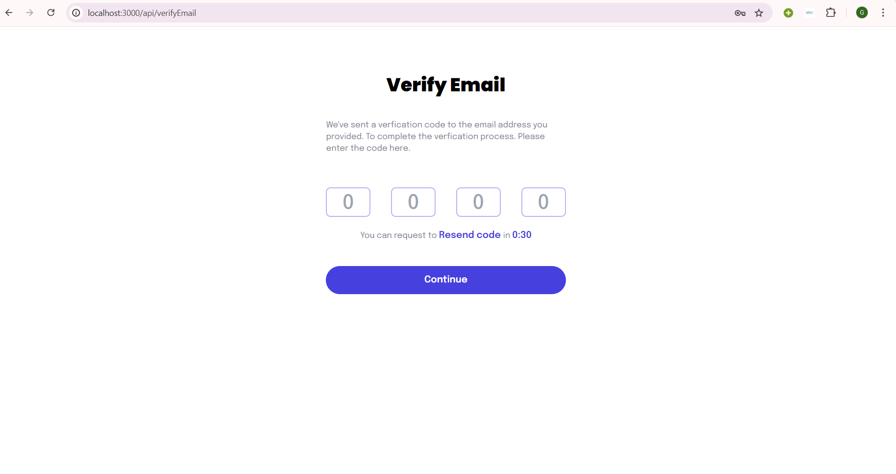

# Task 8: User Authentication

## Overview

Implemented user authentication using NextAuth with Google and credentials. Integrated signup and signin pages with client-side and server-side protection.

## Technologies

- **Next.js**
- **TypeScript**
- **NextAuth.js**
- **React Hook Form**
- **RTK Query & RTK**


## Screenshots

### Job Listing Dashboard


### SignUp page


### SignIn page


### Verify email page



## Installation

1. **Clone the repository**:

   ```bash
   git clone https://github.com/Gadisa21/task-8.git

2. **Navigate to the project directory**:

   ```bash
   cd task-8
3. **npm install**:

   ```bash
   npm install
3. **Start the development server:**:

   ```bash
   npm run dev 
